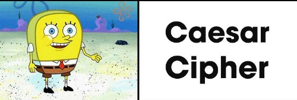

# Old CCipher
<div align="center">

</div>

## Table of Contents
- [About the Project](#about-the-project)
  * [Introduction](#introduction)
  
- [Getting Started](#getting-started)
  * [Prerequisites](#prerequisites)
  * [Installation](#installation)
- [Usage](#usage)
- [Acknowledgements](#acknowledgements)

## About the Project
### Introduction
This project illustrates a basic C++ implementation of the _Caesar Cipher Algorithm_ for the decryption of a specific hidden message for the **CECS 4210 (Ethical Hacking)** Course. 

## Getting Started
### Prerequisites
In order to use this program some form of C++ Compiler must be installed. During the time this code was developed, Microsoft Visual Studio 2017 was used ([link](https://visualstudio.microsoft.com/vs/older-downloads/)). It should be noted that the Microsoft Visual C++ package must be selected when installing the program.
### Installation
After all is up an running, the only thing left to do is to open the _Old_CCipher.cpp_ in the compiler and run it.

## Usage
The _Old_CCipher_ program can be divided into two (2) sections, where:
1. The _main_ will already include the encrypted message (_enMsg_) and the key (_key_) necesary to decrypt it. Furthermore, from here, the _monoAlphabetic_ function will be called so to decrypt such encrypted message. The lines of code are shown below:
```Cpp
int main(){
    string enMsg = "frparnddlafmudkafcinnamifcaopmafpcasiqkacaqpnceaflikrtedqpfqdfckahvciaffdspcasiagiprcdrdnsidvkodrcgauuaqvncqepnnifmir";
    string key = "phqgiumeajlnofdybkrcvstxzw";

    cout << "Mono-Alphabetic Cipher\n\n";
    cout << "The encrypted message is: " << enMsg << endl << endl; 
    cout << "The decrypted message is: " << monoAlphabetic(enMsg,key) << endl; 
}
```
2. As stated previously, the _monoAlphabetic_ function will be tasked to decrypt the encrypted message; given that in order to do so it needs the message and key, it includes parameters for both. Furthermore, it utilizes two (2) variables, i.e.: _alphabet_ and _solution_, to hold all letters of the English alphabet in order and the plaintext solution, respectively. Lastly, what follows are two nested for-loops for the generation of, well, the plaintext solution.
```Cpp
string monoAlphabetic(string enMsg, string key){
    const string alphabet = "abcdefghijklmnopqrstuvwxyz"; 
    string solution =""; 
    for(int i =0; i<enMsg.size();i++){
        for(int k = 0; k<key.size();k++){ 
            if(key[k] == enMsg[i]){ 
                solution = solution + alphabet[k]; 
            }
        }
    }
    return solution;
}
```
In all, the encrypted and decrypted messages are the following:
- Encrypted Message: **frparnddlafmudkafcinnamifcaopmafpcasiqkacaqpnceaflikrtedqpfqdfckahvciaffdspcasiagiprcdrdnsidvkodrcgauuaqvncqepnnifmir**.
- Decrypted (Plaintext) Message: **nsaislookingforintelligentimaginativecriticalthinkerswhocancontributeinnovativeideastosolveourmostdifficultchallenges**.

## Acknowledgements
- Polythecnic University of Puerto Rico: CECS 4210 (Ethical Hacking) Course. (WINTER 2019)
- [Caesar cipher - Wikipedia](https://en.wikipedia.org/wiki/Caesar_cipher)
- [The Caesar cipher (video) - Khan Academy](https://www.khanacademy.org/computing/computer-science/cryptography/crypt/v/caesar-cipher)
- [Logo](https://www.google.com/url?sa=i&url=https%3A%2F%2Fme.me%2Fi%2Fcaesar-cipher-hash-hash-with-salt-b%25D1%2581rypt-quantum-encryption-has-583a246682c34003876df03e2d035b82&psig=AOvVaw0D0MtsQUlZsPJ8MbXUyVWY&ust=1649828843299000&source=images&cd=vfe&ved=0CAoQjRxqFwoTCJi8k8TpjfcCFQAAAAAdAAAAABAD)

